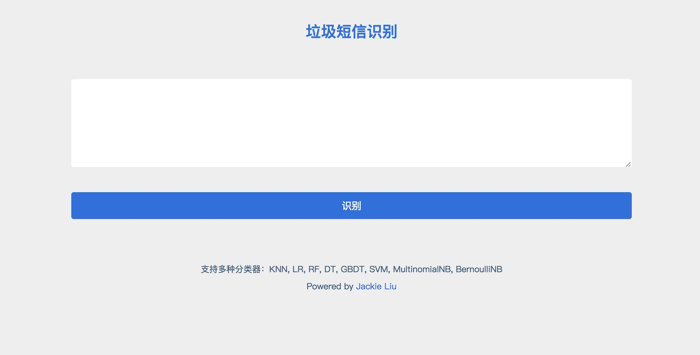
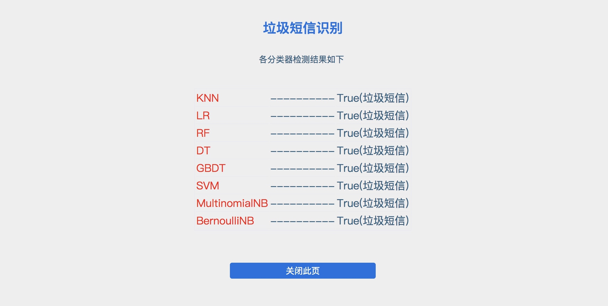

# SpamMessage
实现一个垃圾短信识别系统，在给定的数据集上验证效果.

## 短信数据
- 标签域: 1表示垃圾短信/0表示正常短信
- 文本域: 短信源文本(进行了一些处理)

## 分类算法
- KNN: K最近邻
- LR: 逻辑回归
- RF: 随机森林
- DT: 决策树
- GBDT: 梯度提升决策树
- SVM: 支持向量机
- MultinomialNB: 多项式分布朴素贝叶斯
- BernoulliNB:  伯努利分布朴素贝叶斯

## 环境依赖
- Classfier（模型训练）
    - [Python 2.7.x](https://www.python.org/downloads/)
    - [Scikit-learn](http://scikit-learn.org/stable/documentation.html#)
    - [jieba](https://github.com/fxsjy/jieba) （已集成至项目内，无需安装）
- Sites (演示Demo)
	- [Apache + PHP](http://php.net/)
	- [Python 2.7.x](https://www.python.org/downloads/)

## 项目结构
    .
    ├──Classfier（模型训练）
    │  ├── DataProcess(数据预处理)
    │  │   ├── jieba(结巴分词库)
    │  │   ├── DataPreprocess.py(数据预处理)
    │  │   └── message.txt(训练数据)
    │  │
    │  └── Classifiers.py(分类器)
    │ 
    ├── Sites (演示Demo)
    │   ├── Model
    │   │   ├── jieba(结巴分词库)
    │   │   ├── all_raw(结巴分词库)
    │   │   │   ├── model(训练出的模型)
    │   │   │   └── vec_tfidf(训练阶段生成的词向量)  
    │   │   │
    │   │   └── demoAPI.py(demo调用Python接口)
    │   │
    │   ├── index.php(主页)
    │   └── result.php(结果显示页面)
	│
    └── README.md
    
## 使用说明
#### 首先对数据进行预处理，命令如下：

	$ cd Classfier/DataProcess
	$ python DataPreprocess.py

> DataPreprocess.py 中主要参数变量含义如下：
- n_components: 降维到n_components维
- data_lines: 预处理的短信条数
- data_type: 预处理类型 `{raw, pca, nmf, pca&nmf}`

#### 训练分类器，命令如下：

    $ cd ..
    $ python Classifiers.py
    
> 注意修改代码中相关路径，Classifiers.py 中主要参数变量含义如下：
- takeup: 测试数据占总数据的比例

#### 配置演示Demo
1. 将数据预处理阶段生成的词向量 `vec_tfidf` 文件 放置 `Sites/Model/all_raw` 目录下
2. 将训练阶段生成的模型文件放置`Sites/Model/all_raw/model` 目录下
3. 将 `Sites` 目录下文件放置 apache 相应网站目录下
4. 访问 index.php